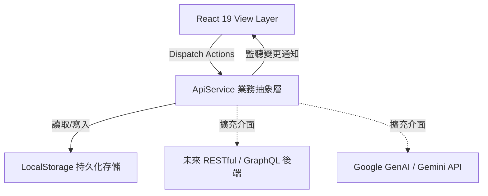

# 工程研發專案管理系統 (PMS) - 系統架構與設計文件 (DESIGN.md)

本文件詳述工程研發專案管理系統（PMS）之整體系統架構、領域資料模型、前端元件結構與技術決策。

---

## 1. 系統架構總覽 (Architecture Overview)

系統採用**單向資料流**與**服務層抽象化**架構，目前運行於前端單頁應用（SPA），並具備向雲端微服務或 BaaS（如 Supabase/PostgreSQL）平滑遷移的能力。



---

## 2. 核心技術選型 (Tech Stack)

| 領域 | 選型技術 | 選擇理由 |
| :--- | :--- | :--- |
| **框架** | React 19 + TypeScript | 最新 React 19 渲染效能、強型別安全與元件生態豐富。 |
| **建置** | Vite 6 | 極速熱重載 (HMR)、最佳化之生產打包與相依性預編譯。 |
| **樣式** | TailwindCSS v4 | Utility-first，不需繁複 CSS 檔即可實現現代化高階 UI。 |
| **動畫** | Motion | 打造細緻流暢之卡片拖曳與抽屜進出場微動畫。 |
| **圖示** | Lucide React | 一致性高、語意明確的工程與辦公圖標庫。 |
| **AI 準備**| `@google/genai` | 預留 Gemini API 介面，供後續圖紙比對與智慧工務助理擴充。 |

---

## 3. 領域模型設計 (Domain Models)

核心實體定義於 [`src/types.ts`](file:///c:/Users/吉咪/Documents/vscode-project/20260911_coding-/src/types.ts)：

### 3.1 組織與專案 (Project & User)
- **User**：使用者基本資料、所屬部門、職稱與系統角色（`SUPER_ADMIN`, `PM`, `MEMBER`, `GUEST_AUDITOR`）。
- **Project**：專案編號、名稱、起訖時程與目前運作狀態。

### 3.2 任務與敏捷看板 (Task & Column)
- **Column**：看板狀態欄位（待處理、進行中、審查中、已完成）。
- **Task**：
  - 基本資訊：標題、優先級（`LOW` ~ `URGENT`）、指派者、協同人員、標籤。
  - 時程資訊：`startDate`、`dueDate`、預估工時、實際工時。
  - 階層與依賴：`parentId`（支援父子工作包）、`dependencies`（前置任務關聯）、`progress`（0~100%）。
  - 關聯：`relatedRfiIds`（直接串聯疑問單）。
  - 排序算法：浮點數位置數值，支援拖曳微調排序。

### 3.3 工程疑問單與稽核 (RFI & Audit Trail)
- **RFI**：發起人、審核主管、受派回答人、主旨、詳細問題描述、建議方案、狀態機（`DRAFT` ➔ `SUBMITTED` ➔ `IN_REVIEW` ➔ `ANSWERED` ➔ `CLOSED` / `REJECTED`）。
- **RFIHistory**：完整留存每次動作（提送、審查、回覆、關閉）的操作人、時間與備註，作為工程履約爭議存證。

### 3.4 附件與評論 (Attachment & Comment)
- **Attachment**：支援實體關聯（`TASK`, `RFI`, `COMMENT`），儲存 Base64 資料或 URL。
- **Comment**：支援 `@mentions` 成員提醒與即時討論。

---

## 4. 前端元件分層結構 (Component Hierarchy)

```
App.tsx (主視角切換: 看板 / 甘特圖 / RFI)
 ├── Navbar.tsx (專案狀態、角色切換、通知中心入口、架構檢驗器入口)
 ├── KanbanBoard.tsx (欄位橫向滾動、卡片拖曳與快速新增)
 ├── GanttChart.tsx (工作包階層樹、時間軸縮放、前置連線與進度條)
 ├── RFIDashboard.tsx (疑問單狀態過濾、統計卡片與表格清單)
 ├── TaskModal.tsx (任務編輯、工時填報、附件上傳與評論串)
 ├── RFIModal.tsx (疑問單審核流轉、歷史稽核時間軸)
 ├── MarkdownEditorWithPaste.tsx (支援 Ctrl+V 貼上圖面截圖)
 ├── LightboxModal.tsx (全螢幕圖紙放大預覽燈箱)
 ├── NotificationDrawer.tsx (通知抽屜)
 └── ArchitectureInspector.tsx (系統資料流與 API Log 檢查器)
```

---

## 5. 設計原則與擴充規範 (Design Principles)

1. **職責單一 (Single Responsibility)**：業務邏輯與資料存取集中於 [`src/services/apiService.ts`](file:///c:/Users/吉咪/Documents/vscode-project/20260911_coding-/src/services/apiService.ts)，UI 元件僅負責互動與呈現。
2. **零阻力圖面交流**：建築與工程溝通以視覺圖紙為主，所有富文本輸入處均支援剪貼簿貼圖（`Win + Shift + S` 後直接 `Ctrl + V`）。
3. **安全審慎的權限隔離**：所有操作均需檢核當前使用者的 Role，唯讀角色（如 `GUEST_AUDITOR`）無法觸發寫入行為。
